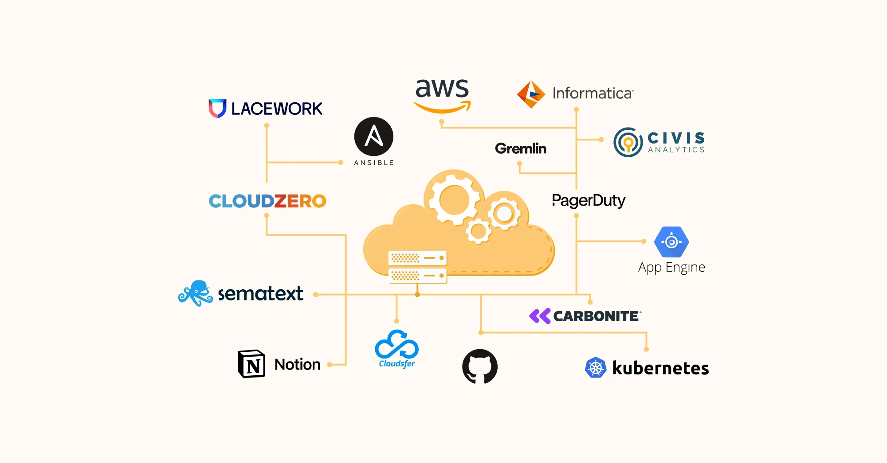
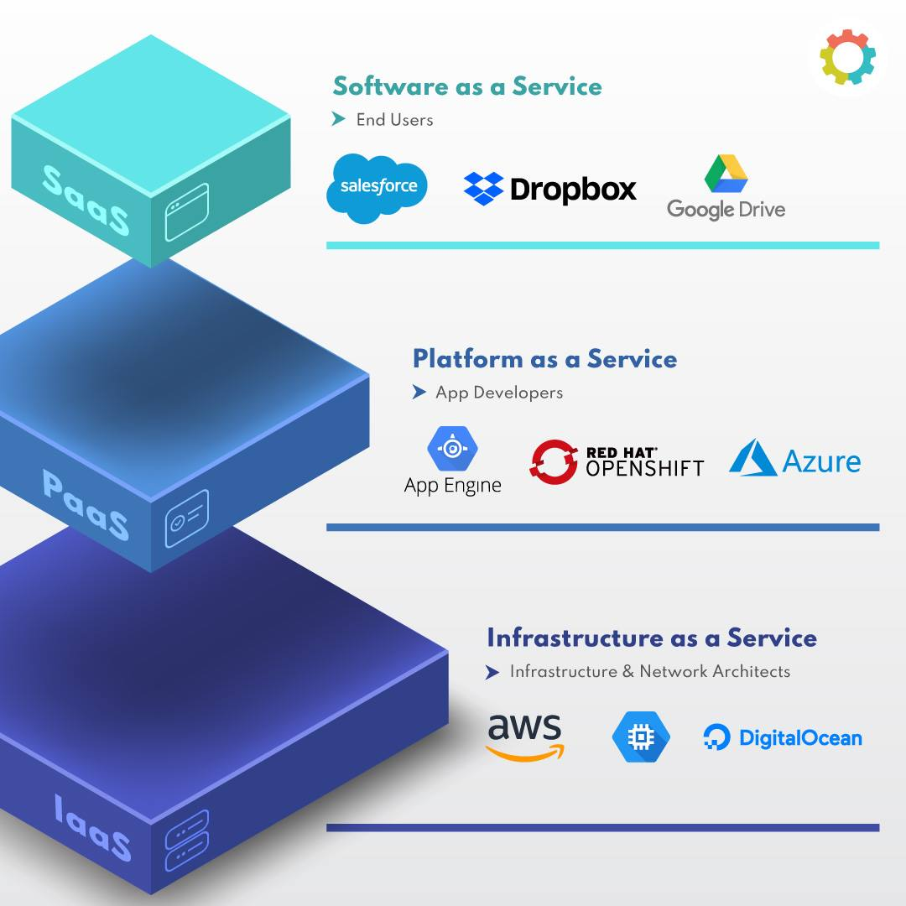

# Clouding Commputing

## What is Clouding Computing?

Cloud computing is the on-demand delivery of IT resources over the Internet. Instead of buying, owning, and maintaining physical data centers and servers, you can access technology services, such as computing power, storage, and databases, on an as-needed basis from a cloud provider like Amazon Web Services (AWS), Kubernetes, or Microsoft Azure.

### Benefits of Clouding Computing

- Agility
- Elasticity
- Cost savings
- Global scale

## What is AWS?

AWS (Amazon Web Services) is a comprehensive, evolving cloud computing platform provided by Amazon that includes a mixture of infrastructure-as-a-service (IaaS), platform-as-a-service (PaaS) and packaged-software-as-a-service (SaaS) offerings. AWS services can offer an organization tools such as compute power, database storage and content delivery services.

### Who uses AWS and Why?

Organizations of every type, size, and industry are using the cloud for a wide variety of use cases, including:

- Big Data Analytics
- Data backup
- Disaster Recovery
- Email
- Virtual Desktops
- Software Development and Testing
- Customer-Facing Web Applications

**Here are the names that are on record publicly as using AWS:**

- Adobe
- Airbnb
- Autodesk
- Bitdefender
- BMW
- Coinbase
- Disney
- Docker
- ESPN
- NASA
- Netflix

## Pass vs IaaS vs SaaS

