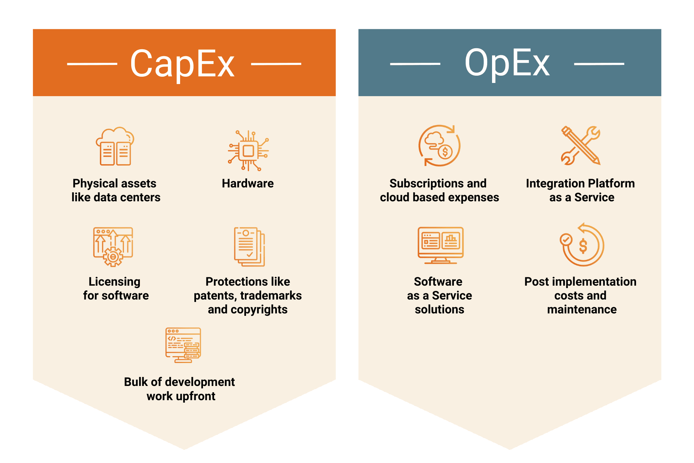
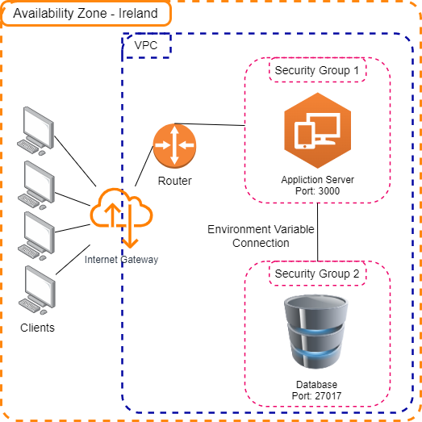

# Clouding Commputing

## What is Clouding Computing?

Cloud computing is the on-demand delivery of IT resources over the Internet. Instead of buying, owning, and maintaining physical data centers and servers, you can access technology services, such as computing power, storage, and databases, on an as-needed basis from a cloud provider like Amazon Web Services (AWS), Kubernetes, or Microsoft Azure.

### Benefits of Clouding Computing

- **Agility**: Cloud computing allows you to scale up or down as needed, so you can quickly adjust to changing business needs. You can also quickly add or remove resources, such as storage or compute power, as your needs change.

- **Cost savings**: Cloud computing can help you reduce your IT costs. You only pay for what you use, so you can scale back or scale up as needed. You can also use tools to monitor and manage your cloud resources, so you can optimize your spending.

- **Global scale**: Cloud computing gives you access to resources in multiple regions around the world. This means you can deliver content to your customers faster, no matter where they are.

- **Security**: Cloud computing providers offer a range of security tools and services to help protect your data and applications. These tools and services are designed to meet the highest security standards.

- **Flexibility**: Cloud computing gives you the flexibility to use the tools and applications you want. You can also use the operating systems and programming languages that you prefer.

- **Reliability**: Cloud computing providers offer high availability and fault tolerance to help ensure that your applications are always available. They also offer disaster recovery services to help you recover from a disaster.

## What is AWS?

AWS (Amazon Web Services) is a comprehensive, evolving cloud computing platform provided by Amazon that includes a mixture of infrastructure-as-a-service (IaaS), platform-as-a-service (PaaS) and packaged-software-as-a-service (SaaS) offerings. AWS services can offer an organization tools such as compute power, database storage and content delivery services.

### Who uses AWS and Why?

Organizations of every type, size, and industry are using the cloud for a wide variety of use cases, including:

- Big Data Analytics
- Data backup
- Disaster Recovery
- Email
- Virtual Desktops
- Software Development and Testing
- Customer-Facing Web Applications

**Here are the names that are on record publicly as using AWS:**

- Adobe
- Airbnb
- Autodesk
- Bitdefender
- BMW
- Coinbase
- Disney
- Docker
- ESPN
- NASA
- Netflix

## SasS vs PasS vs IaaS

### SasS (Software as a Service)

Software as a Service (SaaS) is a software distribution model in which a third-party provider hosts applications and makes them available to customers over the Internet.

For example, **Google Docs** is a SaaS application. You can access it from any computer with an Internet connection, and you don’t have to install any software on your computer.

### PasS (Platform as a Service)

Platform as a Service (PaaS) is a cloud computing model in which a third-party provider delivers hardware and software tools to customers, who can then develop and run their own applications in the cloud.

For example, **Google App Engine** is a PaaS application. You can use it to build and host your own applications in the cloud.

### IaaS (Infrastructure as a Service)

Infrastructure as a Service (IaaS) is a cloud computing model in which a third-party provider delivers virtualized computing resources over the Internet. IaaS is a form of utility computing, in which resources are pooled to serve multiple customers using a multi-tenant model.

For example, **Amazon EC2** is an IaaS application. You can use it to build and host your own applications in the cloud.

## CapEx vs OpEx

### CapEx (Capital Expenditure)

Capital expenditure (CapEx) is the money a company spends to acquire or upgrade physical assets such as property, buildings, or equipment.

Examples of CapEx include:

- Buying a new computer
- Buying a new car
- Buying a new house
- Buying a new office building

### OpEx (Operating Expenditure)

Operating expenditure (OpEx) is the money a company spends on day-to-day business activities, such as employee salaries, rent, utilities, and raw materials.

Examples of OpEx include:

- Renting a car
- Renting an apartment
- Renting a house
- Renting an office building

## 2 Tier Architecture on AWS

The 2-tier architecture is a simple architecture that consists of a presentation layer and a data layer. The presentation layer is the user interface, and the data layer is the database.

### User Data

User data is a script that an instance runs when it starts. You can use user data to automate the configuration of your instances. For example, you can use user data to install software, configure security, or download data from a remote location.

### AMI (Amazon Machine Image)

An Amazon Machine Image (AMI) provides the information required to launch an instance. You must specify an AMI when you launch an instance. You can launch multiple instances from a single AMI when you need multiple instances with the same configuration. You can use different AMIs to launch instances when you need instances with different configurations.

### Sync Instance with local folder

`scp -i "eng130.pem" -r <path/loction/of/local/folder> ubuntu@<public-ip-address>:/home/ubuntu/`

### Installing MongoDB

1. Create a new EC2 instance with Ubuntu Server 18.04 LTS (HVM)
2. Set the security group to allow database connections from App Server
3. Set the port to 27017 (default MongoDB port)
4. Connect to the instance using SSH
5. Follow the [Documention](https://github.com/AbisheK0726/eng130-virtualisation#steps-to-follow-for-db-setup) to install and connect to MongoDB

## Disaster Recovery

## What is Disaster Recovery?

AWS provides a range of disaster recovery stratgies to help you recover from a disaster. These can be broadly divided into four categories:

- low cost and low complexity, such as Amazon S3 to store backups
- low high and high complexity, such as having a standby environment in different active regions
- Active Sites, such as an AWS Region to host the workload and serve traffic.
- Passive Sites, such as a different AWS Region is used for recovery. The passive site does not actively serve traffic until a failover event is triggered.

It is critical to regularly assess and test your disaster recovery strategy so that you have confidence in invoking it, should it become necessary.

## What is S3?

Amazon Simple Storage Service (Amazon S3) is an object storage service that offers industry-leading scalability, data availability, security, and performance. This means customers of all sizes and industries can use it to store and protect any amount of data for a range of use cases, such as data lakes, websites, mobile applications, backup and restore, archive, enterprise applications, IoT devices, and big data analytics.

[How to Connect to S3](setup-Connection-S3.md)

## S3 Buckets

A bucket is a container for objects stored in Amazon S3. Every object is contained in a bucket. Buckets are the fundamental containers in Amazon S3 for data storage. A bucket is similar to a folder in the file system. You can store any number of objects in a bucket.

### Benefits of S3

- **Scalability**: Amazon S3 is designed to scale to meet the needs of your business. You can store as many objects as you want, and you can access them from anywhere on the Internet.

- **Durability**: Amazon S3 is designed to provide 99.999999999% durability, and stores data for millions of applications for companies all around the world.

- **Security**: Amazon S3 provides multiple layers of security to help protect your data. You can use access control lists (ACLs) and bucket policies to control access to buckets and objects. You can also use AWS Identity and Access Management (IAM) to control access to Amazon S3.

- **Performance**: Amazon S3 provides fast, predictable, and scalable performance. Amazon S3 automatically distributes your data across multiple facilities and enables you to choose the location where you want your data to reside.

- **Cost-Effectiveness**: Amazon S3 provides a simple web services interface that can be used to store and retrieve any amount of data, at any time, from anywhere on the web. You pay only for the storage you actually use.

- **Integrations**: Amazon S3 integrates with other AWS services, such as Amazon Elastic Compute Cloud (Amazon EC2), Amazon Elastic Block Store (Amazon EBS), Amazon Glacier, Amazon CloudFront, and AWS Lambda.

### Use Cases of S3

- **Data Archiving**: Amazon S3 is a great storage location for data that is infrequently accessed and long-lived. You can use Amazon S3 to store data for disaster recovery, data lakes, and backups.

- **Data Backup and Recovery**: Amazon S3 is a secure, durable, highly-scalable, and low-cost storage service that can be used for data backup and recovery.

- **Disaster Recovery**: Amazon S3 is a secure, durable, highly-scalable, and low-cost storage service that can be used for data backup and recovery.

- **Data Lake Storage**: Amazon S3 is a secure, durable, highly-scalable, and low-cost storage service that can be used for data backup and recovery.
