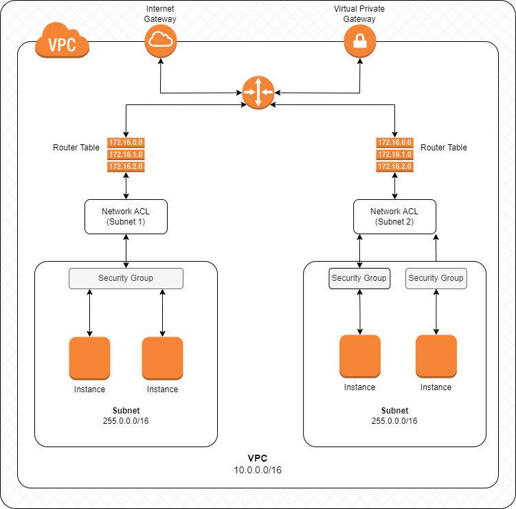
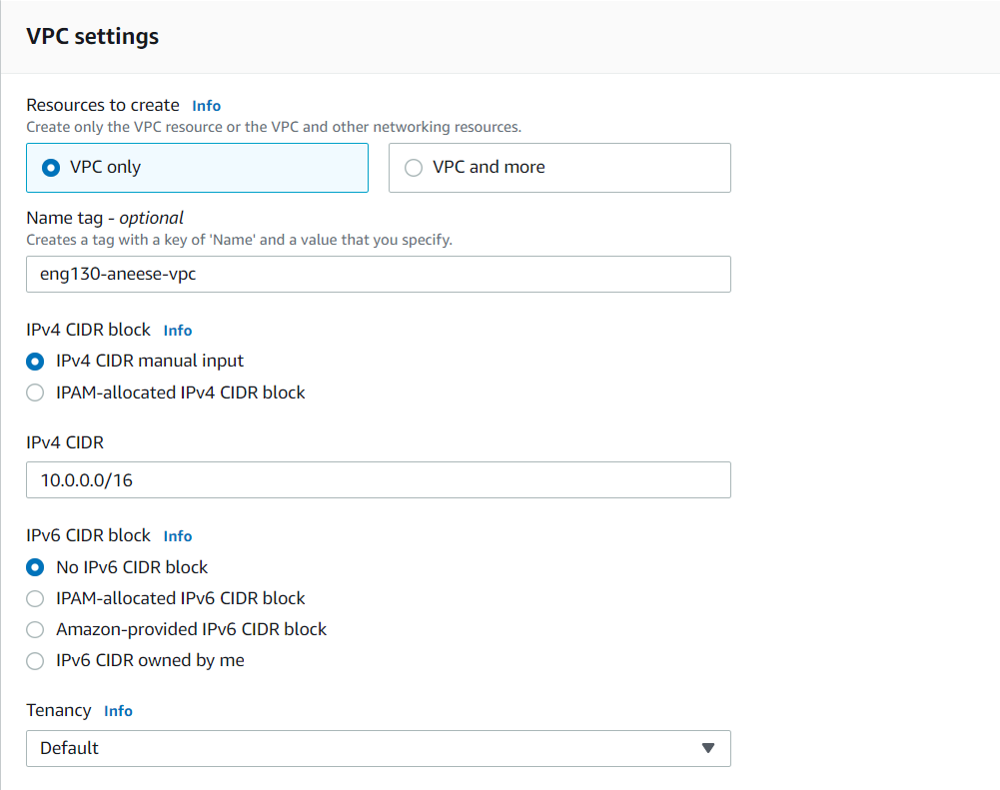
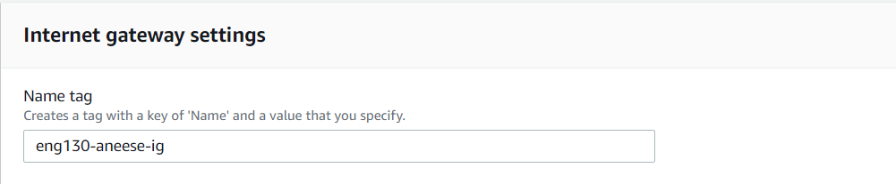
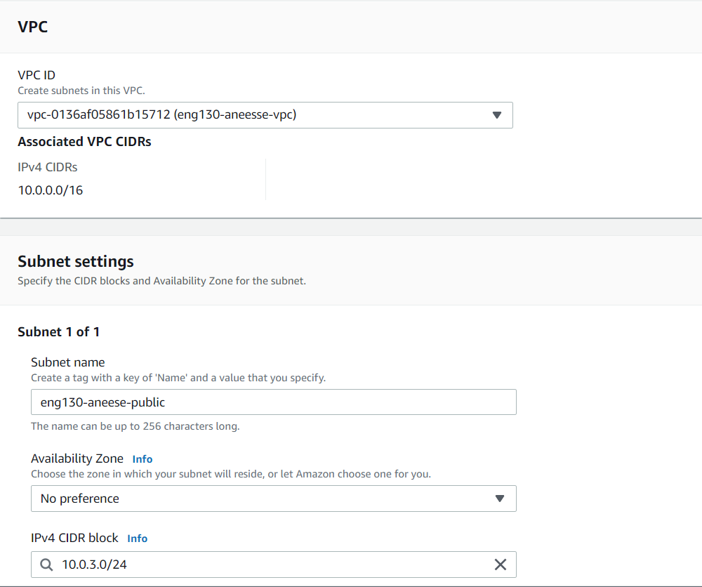
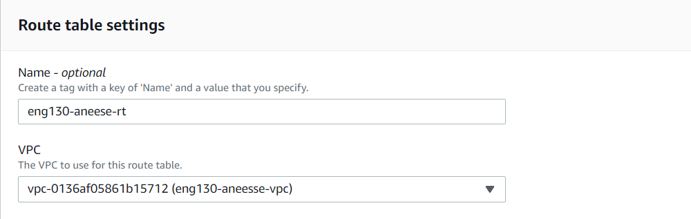
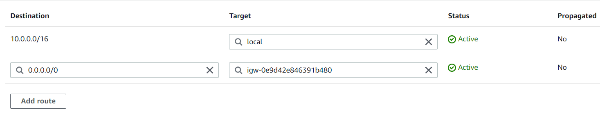
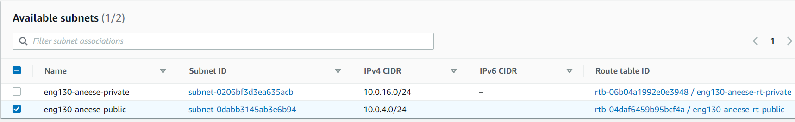
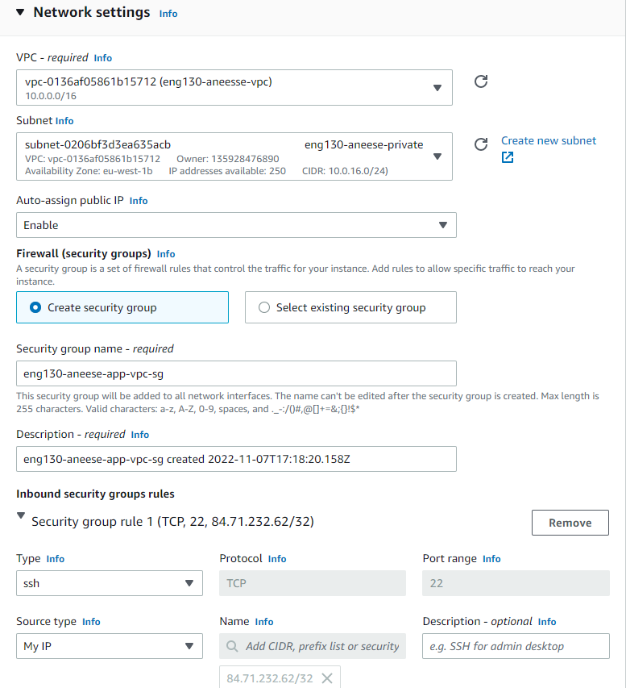
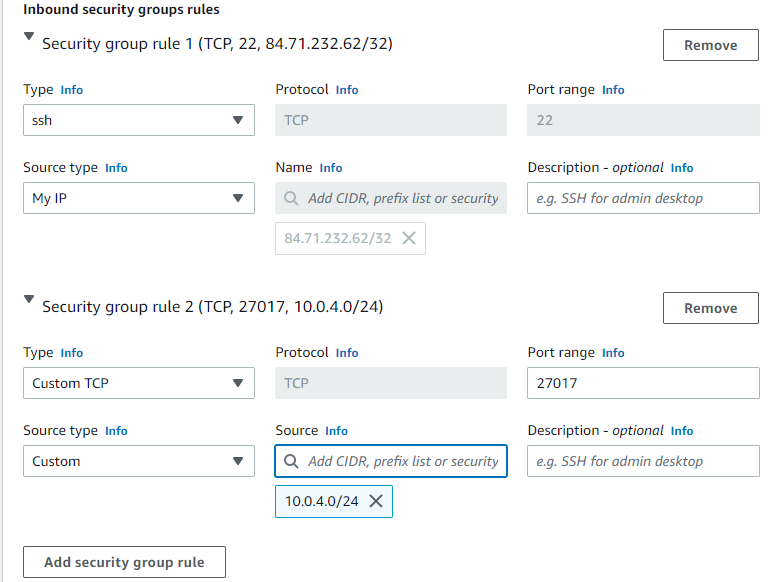

# VPC

## What is a VPC?

A VPC is a virtual network dedicated to your AWS account. It is logically isolated from other virtual networks in the AWS Cloud. You can launch your AWS resources, such as Amazon EC2 instances, into your VPC. You can specify an IP address range for the VPC, add subnets, associate security groups, and configure route tables.

### Internet Gateway

An internet gateway is a horizontally scaled, redundant, and highly available VPC component that allows communication between instances in your VPC and the internet. It performs network address translation (NAT) for instances that have been assigned public IPv4 addresses.

### Route Table

A route table contains a set of rules, called routes, that are used to determine where network traffic from your subnet or gateway is directed. Each route table contains a local route for the virtual private cloud (VPC) that contains it, and a default route for outbound traffic.

### Cidr Block

CIDR stands for Classless Inter-Domain Routing. It is a method of allocating IP addresses and IP routing. CIDR is a superset of the older system of allocating IP addresses. CIDR uses a slash notation to indicate the number of bits in the network prefix. For example, the CIDR block

### Subnet

A subnet is a range of IP addresses in your VPC. You can launch AWS resources, such as Amazon EC2 instances, into a subnet. You specify the size of the subnet when you create it, and you can't change the size after you create it. You can create as many subnets as you want in a VPC. You can create subnets in each Availability Zone.

### NACL

A network access control list (ACL) is an optional layer of security for your VPC that acts as a firewall for controlling traffic in and out of one or more subnets.

You can use network ACLs to allow or deny traffic to and from specific Amazon EC2 instances in your VPC. You can create a network ACL for each subnet in your VPC, and then associate the network ACL with the subnet.

Each network ACL has an inbound rule list and an outbound rule list. When you add a rule to a network ACL, you specify whether the rule allows or denies traffic, and the rule applies to traffic that matches the rule's destination or source.

Each network ACL has a default inbound rule and a default outbound rule. The default inbound rule denies all inbound traffic, and the default outbound rule allows all outbound traffic.

You can't delete the default rules, but you can change them. When you create a network ACL, by default it has no rules in it, and therefore no traffic is allowed through the network ACL. You must add rules to the network ACL to control traffic.

### Difference between NACL and Security Group

| NACL | Security Group |
| --- | --- |
| NACL is stateless | Security Group is stateful |
| NACL is at subnet level | Security Group is at instance level |
| NACL is a network level firewall | Security Group is a security group level firewall |

## Steps to create a VPC in AWS

1. Create a VPC - 10.0.0.0/16
2. Create a internet gateway
3. Attach the internet gateway to the VPC
4. Create a public subnet - 10.0.4.0/24
5. Route table - Attach to VPC
6. Add a routes to the route table - Connect to the internet gateway
7. Asscoiate the route table with the public subnet and launch an EC2 instance

### Create a VPC

1. Go to the VPC dashboard
2. Click on Create VPC
3. Enter a name tag `eng130-vpc`
4. Enter a IPv4 CIDR block `10.0.0.0/16`
5. Click on Create VPC

### Create an Internet Gateway

1. Go to the VPC dashboard
2. Click on Internet Gateways
3. Click on Create Internet Gateway
4. Enter a name tag `eng130-ig`
5. Click on Create Internet Gateway

### Attach the Internet Gateway to the VPC

1. Go to the VPC dashboard
2. Click on Internet Gateways
3. Select the newly created Internet Gateway
4. Click on Actions
5. Click on Attach to VPC
6. Select the VPC `eng130-vpc`
7. Click on Attach Internet Gateway

### Create a Public and Private Subnet

1. Go to the VPC dashboard
2. Click on Subnets
3. Click on Create Subnet
4. Enter a name tag `eng130-public-subnet`
5. Select the VPC `eng130-vpc`
6. Enter a IPv4 CIDR block `10.0.X.0/24` for the public subnet
7. Repeat the steps to create a private subnet
8. Change the name tag to `eng130-private-subnet`
9. Change the IPv4 CIDR block to `10.0.Y.0/24`

### Create a Route Table

1. Go to the VPC dashboard
2. Click on Route Tables
3. Click on Create Route Table
4. Enter a name tag `eng130-public-route-table`
5. Select the VPC `eng130-vpc`
6. Click on Create Route Table
7. Repeat the steps to create a private route table
8. Change the name tag to `eng130-private-route-table`

### Add a Route to the Route Table

1. Click on Route Tables
2. Select the newly created public route table
3. Click on Routes
4. Click on Edit routes
5. Click on Add route
6. Enter a destination `0.0.0.0/0`
7. Select the internet gateway as the target `eng130-ig`
8. Click on Save routes

### Associate the Route Table with the Subnet

1. Click on Route Tables
2. Select the newly created public route table
3. Click on Subnet Associations
4. Click on Edit subnet associations
5. Select the public subnet `eng130-public-subnet`
6. Click on Save subnet associations
7. Repeat the steps to associate the private route table with the private subnet

### Launch an EC2 Instance in the Public Subnet

1. Follow the steps to launch an EC2 instance
2. Select the App Server AMI
3. Edit the network settings
4. Select the newly created VPC `eng130-vpc`
5. Select the public subnet as No Preference
6. Enable auto-assign public IP
7. Select create a new security group
8. Enter a name tag `eng130-app-sg`
9. Add a rule to allow HTTP traffic
10. Add a rule to allow SSH traffic
11. Click on Review and Launch

### Launch an EC2 Instance in the Private Subnet

1. Follow the steps to launch an EC2 instance
2. Select the Database Server AMI
3. Edit the network settings
4. Select the newly created VPC `eng130-vpc`
5. Select the private subnet as No Preference
6. **Disable** auto-assign public IP
7. Create a new security group
8. Enter a name tag `eng130-db-sg`
9. Add a rule to allow SSH traffic
10. Add a rule to allow Mongodb traffic from the app server public subnet i.e. `port: 27017` `source: 10.0.X.0/24`
11. Click on Review and Launch

### Deploy the App
