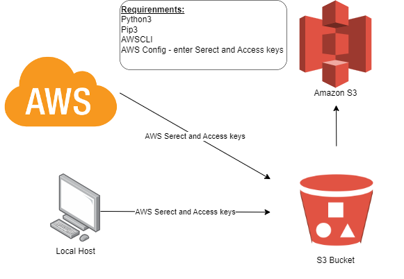

# Setup Connection to S3



## Install Python3 and PIP

```bash
sudo apt-get install python3
sudo apt-get install python3-pip
alias python=python3
python --version
```

## Install AWS CLI

```bash
sudo pip install awscli
```

## Configure AWS CLI

**_NOTE_**: DO NOT SHARE YOUR AWS CREDENTIALS WITH ANYONE

```bash
aws configure
Enter AWS Access Key ID: `AWSACCESSENG130EXAMPLE`
Enter AWS Secret Access Key: `spArTGloBAl/ENG130DO/EXAMPLEKEY`
Enter Default region name: `ew-east-1`
Enter Default output format: `json`
```

## Test AWS CLI

```bash
aws s3 ls
```

You should see a list of buckets